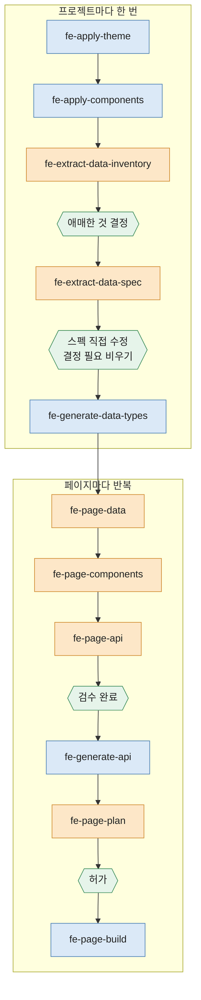
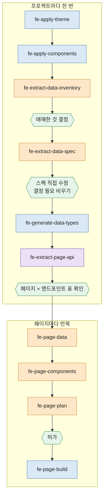

# dk-fe-bundle

화면 디자인에서 출발해 Next.js 페이지 코드까지 만드는 Claude Code 플러그인이다.
프로젝트마다 한 번 도는 스킬 5개, 페이지마다 반복하는 스킬 6개, 전체 페이지의 API 를 한 번에 뽑는 스킬 1개, 모두 12개의 스킬이 들어 있다.

스킬은 바로 코드를 쓰지 않는다. 단계마다 판단을 핸드오프 문서로 남기고, 사람이 그 문서를 검수한 뒤 다음 스킬이 그 문서만 보고 움직인다.

## 설치

```
/plugin marketplace add dkGithup2022/dk-fe-bundle
/plugin install dk-fe-bundle@dk-fe-bundle
```

설치하면 `/dk-fe-bundle:fe-page-data` 처럼 호출한다. 인자는 스킬마다 다르다. 예를 들어 페이지 스킬은 라우트 이름과 그 페이지의 화면 이미지를 받는다.

```
/dk-fe-bundle:fe-page-data groups designs/s02-groups.png
```

산출물은 플러그인 폴더가 아니라 **작업 중인 프로젝트**의 `docs/` 와 `src/` 아래에 만들어진다.

설치하지 않고 한 세션에서만 써 보려면 저장소를 받은 뒤 `--plugin-dir` 로 띄운다.

```
git clone https://github.com/dkGithup2022/dk-fe-bundle.git
cd <작업 프로젝트>
claude --plugin-dir <받은 경로>/dk-fe-bundle
```

플러그인 없이 쓰려면 `skills/` 아래 폴더를 작업 프로젝트의 `.claude/skills/` 로 복사한다. 이때는 `/fe-page-data` 처럼 앞의 `dk-fe-bundle:` 없이 부른다.

필요한 도구:
- Node.js 와 npm. 스킬이 끝날 때마다 `npm run typecheck && npm run lint && npm run test:run` 을 돌린다.
- Playwright MCP. 와이어프레임 스크린샷과 실제 라우트 대조에 쓴다 (`fe-page-plan`, `fe-page-build`).

## 폴더 구성

| 폴더 | 내용 |
|---|---|
| `skills/` | 스킬 12개의 진입점 (`SKILL.md`) |
| `examples/` | 스킬마다 실제 실행에서 무엇이 들어가고, 사람이 무엇을 정했고, 무엇이 나왔는지 발췌한 문서 |

---

## 관점

이 체인은 다음 생각에서 출발했다.

**1. AI 에게 한 번에 페이지를 맡기면 판단이 코드 속에 묻힌다.**
"이 화면 만들어 줘" 한 번이면 데이터 모양, 컴포넌트 경계, API 설계, 여백 같은 결정이 전부 코드 안에서 조용히 내려진다. 틀린 결정을 찾으려면 코드를 읽어야 하고, 고치면 다른 곳이 깨진다. 그래서 판단을 코드보다 먼저, 사람이 읽을 수 있는 문서로 꺼낸다.

**2. 판단하는 스킬과 옮기는 스킬을 나눈다.**
스킬은 두 종류다.
- **문서를 쓰는 스킬.** 화면과 기존 코드를 읽고 판단해서 핸드오프 문서를 남긴다. 코드 파일은 만들지 않는다.
- **코드를 만드는 스킬.** 검수가 끝난 문서를 그대로 코드로 옮긴다. 판단하지 않고, 문서에 없는 것은 만들지 않는다.

사람은 문서를 쓰는 스킬의 결과만 보면 된다. 코드를 만드는 스킬은 문서가 맞으면 맞게 돈다.

**3. 스킬은 억지로 정하지 않는다.**
화면만 봐서는 정할 수 없는 것이 반드시 나온다. 이게 도메인인지 기능 데이터인지, 이 컴포넌트를 공용으로 올릴지, 제출 뒤 어디로 가는지 같은 것들이다. 스킬은 이런 것을 문서의 "결정 필요" 나 "애매한 것" 절에 후보와 이유를 붙여 올리고 사람에게 맡긴다. 다음 스킬은 그 절이 비어야 시작한다.

**4. 사람이 멈춰 세우는 지점을 문서의 상태 줄로 둔다.**
`api.md` 는 "검수 완료" 여야 API 코드를 만들고, `plan.md` 는 "허가" 여야 페이지를 만든다. 대화 기록이 아니라 파일에 남아 있어서, 세션이 끊겨도 어디까지 왔는지 알 수 있다.

**5. 코드가 진실이다.**
스킬은 실행할 때마다 `src/` 를 읽어 이미 있는 타입 · 컴포넌트 · API 를 확인하고 재사용한다. 사람이 따로 유지하는 목록 문서는 두지 않는다. 핸드오프 문서는 인수인계용이지 규칙 문서가 아니다.

**6. 근거를 남긴다.**
필드, enum 값, 요청 파라미터마다 근거가 된 화면 파일명과 화면 문구를 적는다. 나중에 "이 필드는 왜 있지" 를 문서에서 바로 찾을 수 있다.

---

## 전제: 작업 프로젝트의 구조

스킬은 아래 구조를 가진 Next.js (App Router) 프로젝트를 전제로 쓰였다. 원본 템플릿은 `nextjs-fe-base` 다 (공개 예정). 다른 프로젝트에 쓰려면 아래를 맞추거나, 스킬 본문의 경로를 바꾼다.

| 구조 | 쓰는 스킬 |
|---|---|
| `src/app/globals.css` 의 색 토큰 이름과 `@theme` 별칭 | fe-apply-theme, fe-apply-components |
| `src/components/ui/` (도메인 무관), `src/components/{domain}/` (도메인 전용) | fe-apply-components, fe-page-components, fe-page-build |
| `src/types/data/domain/`, `src/types/data/feature/` (화면이 쓰는 모양) | fe-generate-data-types, fe-page-data |
| `src/types/api/` 와 목록 응답 타입 `PaginatedResponse` (`common.ts`) | fe-page-data, fe-generate-api |
| `src/lib/api/client.ts` 의 `apiGet` · `apiPost` 계열과 `toQueryParams`. 백엔드 호출은 전부 이것으로 | fe-generate-api, fe-page-build |
| `src/lib/api/mock/handlers.ts` 의 mock 등록과 `NEXT_PUBLIC_USE_MOCK` | fe-generate-api |
| 페이지마다 `page.tsx` (서버, metadata) + `*Client.tsx` (상태 · 이벤트) + `loading.tsx` | fe-page-plan, fe-page-build |
| `npm run typecheck`, `lint`, `test:run` (vitest) | 전부 |

---

## 스킬 목록

### 프로젝트마다 한 번

| # | 스킬 | 성격 | 하는 일 | 산출물 | 사람이 하는 일 | 실행 예시 |
|---|---|---|---|---|---|---|
| 1 | `fe-apply-theme` | 코드 | 디자인의 팔레트 · 타이포 표를 테마 파일로 만들고 앱이 읽게 한다 | `src/styles/themes/{name}.css` | 토큰 대응표와 확장 토큰 확인 | [보기](examples/fe-apply-theme/input-output.md) |
| 2 | `fe-apply-components` | 코드 | 디자인의 공용 컴포넌트 시트를 `ui/` 컴포넌트로 옮긴다 | `src/components/ui/*`, 확인 페이지 `/dev/ui` | 작업 목록 확인, 시트와 대조 | [보기](examples/fe-apply-components/input-output.md) |
| 3 | `fe-extract-data-inventory` | 문서 | 화면 전체에서 논리적 도메인과 기능 데이터의 목록을 뽑는다 | `docs/data-inventory.md` | "애매한 것" · "소속 미정 필드" 결정 | [보기](examples/fe-extract-data-inventory/input-output.md) |
| 4 | `fe-extract-data-spec` | 문서 | 항목마다 화면에 근거한 필드 · 타입 · enum 값을 정한다 | `docs/data-spec.md` | 문서를 직접 고치고 "결정 필요" 를 비운다 | [보기](examples/fe-extract-data-spec/input-output.md) |
| 5 | `fe-generate-data-types` | 코드 | 검수한 스펙을 타입 파일로 옮긴다 | `src/types/data/*` | 없음 | [보기](examples/fe-generate-data-types/input-output.md) |

3 · 4 · 5 는 백엔드 스펙이 먼저 있으면 그것을 입력으로 쓴다. 그때는 화면 대신 백엔드 스펙이 필드 이름과 값의 근거다.

### 페이지마다 반복

문서는 전부 `docs/pages/{라우트 이름}/` 에 쌓인다.

| # | 스킬 | 성격 | 하는 일 | 산출물 | 사람이 하는 일 | 실행 예시 |
|---|---|---|---|---|---|---|
| 1 | `fe-page-data` | 문서 | 그 페이지의 데이터를 공용 · API · 페이지 전용으로 가른다 | `data.md` | 분류 확인, "애매한 것" 결정 | [보기](examples/fe-page-data/input-output.md) |
| 2 | `fe-page-components` | 문서 | 영역마다 공용 컴포넌트를 쓸지, 도메인 컴포넌트를 새로 만들지, 공용으로 올릴지 정한다 | `components.md` | 공용 승격 · 기존 컴포넌트 수정 결정 | [보기](examples/fe-page-components/input-output.md) |
| 3 | `fe-page-api` | 문서 | 동작을 도메인 CRUD · 페이지 안 동작 · 유즈케이스로 나누고 엔드포인트마다 요청 · 응답을 적는다 | `api.md` (검수 대기) | "결정 필요" 를 비우고 "검수 완료" 로 | [보기](examples/fe-page-api/input-output.md) |
| 4 | `fe-generate-api` | 코드 | 검수한 `api.md` 의 새 API 를 타입 · mock · 호출 함수 · 테스트로 옮긴다 | `types/api`, `lib/*-data.ts`, `handlers.ts`, `lib/*-api.ts` | 없음 | [보기](examples/fe-generate-api/input-output.md) |
| 5 | `fe-page-plan` | 문서 | 문서끼리의 충돌을 검사하고 구조 · 상태 · 동작 · 못 읽은 UI 세부를 계획서로 쓴다. 와이어프레임을 띄운다 | `plan.md` (검사 대기), `/dev/wireframe/*` | 보고 "허가" 로 | [보기](examples/fe-page-plan/input-output.md) |
| 6 | `fe-page-build` | 코드 | 허가된 계획서대로 페이지를 만들고 실제 화면과 대조한다 | `src/app/{route}/`, 도메인 컴포넌트, 제작 기록 | 실제 라우트를 화면과 대조 | [보기](examples/fe-page-build/input-output.md) |

### API 를 한 번에 뽑는 스킬 (흐름 B)

| 스킬 | 성격 | 하는 일 | 산출물 | 사람이 하는 일 |
|---|---|---|---|---|
| `fe-extract-page-api` | 문서 + 코드 | 화면 전체를 페이지 단위로 읽어 페이지 × 엔드포인트 표를 만들고, 확인받은 뒤 타입 · mock · 호출 함수 · 테스트까지 한 번에 만든다 | `types/api`, `lib/*-data.ts`, `handlers.ts`, `lib/*-api.ts`, 테스트 | 페이지 × 엔드포인트 표 확인 |

페이지마다 쓰는 `fe-page-api` + `fe-generate-api` 두 스킬의 일을 전체 페이지에 대해 한 번에 하는 스킬이다. 어느 쪽을 쓸지는 아래 흐름도에서 고른다. 이 스킬은 실행 예시가 없다.

실행 예시는 모두 Peeple(지역 모임 · 이벤트 서비스)을 이 체인으로 만든 실제 실행에서 발췌했다. 페이지 단계는 홈 페이지를 끝까지 돈 기록이다.

---

## 흐름도

API 를 어떻게 만드느냐에 따라 두 가지 흐름이 있다. 테마 · 컴포넌트 · 데이터 단계는 두 흐름이 같다.

색 구분: 주황은 문서를 쓰는 스킬, 파랑은 코드를 만드는 스킬, 보라는 문서와 코드를 함께 만드는 스킬, 초록은 사람이 멈춰 세우는 지점이다. 앞 단계로 되돌아가는 경로는 아래 "되돌아가는 경우" 표에 있다.

### 흐름 A: 페이지마다 API 를 문서로 검수하고 만든다 (기본)

API 를 페이지마다 문서(`api.md`)로 먼저 쓰고, 사람이 검수한 뒤 코드로 옮긴다. 백엔드와 협의할 문서가 페이지마다 남는다. 백엔드 스펙이 아직 없거나 자주 바뀔 때 맞다.



### 흐름 B: 전체 페이지의 API 를 한 번에 만든다

데이터 타입을 만든 뒤 `fe-extract-page-api` 로 모든 페이지의 API 를 한 번에 코드까지 만든다. 그다음 페이지마다 데이터 → 컴포넌트 → 계획 → 제작만 돈다. 페이지별 API 문서가 남지 않는 대신 빠르다. 화면이 전부 확정돼 있고 API 모양을 한 번에 훑어볼 수 있을 때 맞다.



흐름 B 에서는 `api.md` 가 생기지 않는다. 그래서 `fe-page-plan` 이 동작마다 "부르는 것" 을 적을 때 `api.md` 대신 `fe-extract-page-api` 가 만든 호출 함수(`lib/*-api.ts`)를 본다.

---

## 사람이 멈춰 세우는 지점

| 문서 | 표시 | 다음 스킬이 시작하는 조건 |
|---|---|---|
| `docs/data-inventory.md` | "애매한 것", "소속 미정 필드" 절 | 남아 있으면 스펙 단계에서 다시 묻는다 |
| `docs/data-spec*.md` | "결정 필요" 절 | 비어 있어야 `fe-generate-data-types` 가 시작한다 |
| `docs/pages/{라우트}/data.md` | "애매한 것", "스펙 부족" 절 | "스펙 부족" 이 있으면 스펙 단계로 돌아간다 |
| `docs/pages/{라우트}/components.md` | "공용 승격 후보", "기존 컴포넌트 수정 필요" 절 | 스킬이 하나씩 묻는다 |
| `docs/pages/{라우트}/api.md` | 상태 "검수 대기 → 검수 완료", "결정 필요" 절 | "검수 완료" 이고 "결정 필요" 가 비어야 `fe-generate-api` 가 시작한다 |
| `docs/pages/{라우트}/plan.md` | 상태 "검사 대기 → 허가" | "허가" 여야 `fe-page-build` 가 시작한다 |

## 되돌아가는 경우

| 상황 | 어디로 |
|---|---|
| `fe-page-data` 에서 "스펙 부족" 이 나온다 | `fe-extract-data-spec` 으로 가서 스펙에 보태고 `fe-generate-data-types` 를 다시 돌린다 |
| `fe-page-components` 에서 공용 컴포넌트를 더하거나 고쳐야 한다 | `fe-apply-components` 를 그 핸드오프로 돌린다. 페이지 스킬은 `ui/` 를 직접 만들거나 고치지 않는다 |
| `fe-page-api` 에서 이미 있는 API 의 응답이 모자란다 | "결정 필요" 에 올린다. 넓히기로 하면 그 API 를 쓰는 다른 페이지도 같이 본다 |
| `fe-page-plan` 의 충돌 검사에서 문서끼리 어긋난다 | 어긋난 문서를 고치고 계획을 다시 돌린다. 계획 스킬은 스스로 고치지 않는다 |
| `fe-page-build` 중에 공용 컴포넌트를 고쳐야 한다 | 멈추고 `fe-apply-components` 로 돌린다 |
| 디자인이 바뀐다 | 바뀐 화면이 속한 페이지의 1번부터 다시 한다. 공용 컴포넌트가 바뀌면 `fe-apply-components` 부터 |
| 테마 토큰에 없는 색이 나온다 | `fe-apply-theme` 로 돌아가 확장 토큰을 추가할지 정한다 |

---

## 앞뒤로 이어지는 것

- **앞 단계.** `dk-discovery-bundle` 은 기획에서 디자인 인계까지 맡고, "최종 시안을 FE 트랙으로 넘긴다" 로 끝난다. 그 시안의 팔레트 표, 컴포넌트 시트, 화면 이미지가 이 번들의 입력이다.
- **백엔드와의 연결.** `fe-page-api` 가 남기는 `api.md` 는 페이지 제작의 근거이면서 백엔드와 협의하는 문서가 된다. 페이지를 다 만들고 나면 `api.md` 들과 데이터 스펙을 모아 백엔드 핸드오프로 넘길 수 있다.

## 알려진 한계

- **흐름 B 는 스킬 본문이 아직 따라오지 못한다.** `fe-page-plan` 과 `fe-page-build` 의 본문은 `api.md` 가 있다고 전제하고 쓰여 있다. 흐름 B 로 돌 때는 그 자리를 호출 함수 목록으로 대신 읽으라고 알려 줘야 한다.

- **스킬 본문의 경로가 위 템플릿 구조에 묶여 있다.** 다른 구조의 프로젝트에서는 경로를 바꿔야 한다.
- **원 디자인에 없는 화면은 체인이 입력을 못 받는다.** Peeple 에서는 디자인 랩으로 시안을 만들어 화면 이미지를 대신했다. 이 번들에는 그 단계가 스킬로 들어 있지 않다.
- **뒤 페이지를 만들면 앞 페이지의 빈 연결을 다시 봐야 한다.** 앞 페이지에서 "목적지 라우트가 없어 동작을 빼 둠" 으로 남긴 버튼은 스킬이 자동으로 다시 찾지 않는다. Peeple 에서는 버튼을 전부 눌러 보는 점검으로 이런 곳을 찾았다.
- **mock 의 쓰기 결과는 브라우저 메모리에만 있다.** 주소창으로 새로 열면 초기화되므로, 쓰기 뒤 상태는 같은 세션 안에서 확인해야 한다.
