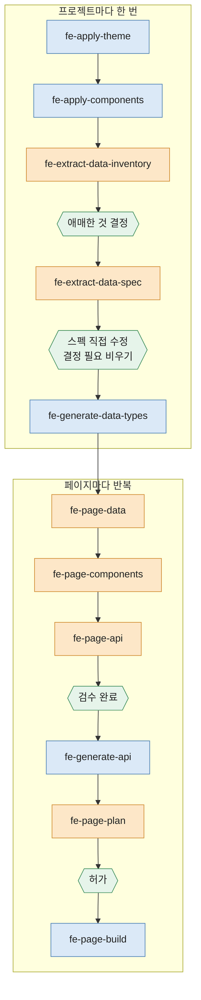

# dk-fe-bundle

Next.js 프론트엔드 소스를 만드는 규칙을 단계별 스킬로 정리한 Claude Code 플러그인이다.

아래 "실행 흐름" 에 따라서 , 실행하면 fe 제품이 만들어 질 수 있도록 제작되었다 .

---

## 준비 및 주의점 .

dk-discovery-bundle 에서 생성한 이미지 시안 , 기획표가 있어야 동작한다 .  
이 스킬 번들에서 디자인 관련한 스킬이 있지만, 직접 처음부터 색 테마/ 디자인을 뽑기를 권하지 않는다 . 

참고  :   https://github.com/dkGithup2022/dk-discovery-bundle

## 설치

```
/plugin marketplace add dkGithup2022/dk-fe-bundle
/plugin install dk-fe-bundle@dk-fe-bundle
```

## 스킬

| 스킬 | 역할 |
|---|---|
| `fe-apply-theme` | 팔레트 · 타이포 표를 테마 CSS 파일로 만든다 |
| `fe-apply-components` | 공용 컴포넌트 시트를 `components/ui/` 컴포넌트로 만든다 |
| `fe-extract-data-inventory` | 화면에서 도메인과 기능 데이터 목록을 뽑는다 |
| `fe-extract-data-spec` | 목록의 항목마다 필드 · 타입 · enum 값을 정한다 |
| `fe-generate-data-types` | 확인된 데이터 스펙을 타입 파일로 만든다 |
| `fe-page-data` | 페이지 하나에 쓰이는 데이터를 공용 · API · 페이지 전용으로 나눈다 |
| `fe-page-components` | 페이지 영역마다 쓸 컴포넌트를 정한다 |
| `fe-page-api` | 페이지 하나가 부르는 API 의 요청 · 응답 스펙을 문서로 쓴다 |
| `fe-generate-api` | 확인된 API 스펙을 타입 · mock · 호출 함수 · 테스트로 만든다 |
| `fe-extract-page-api` | 전체 페이지의 API 를 한 번에 뽑아 코드까지 만든다 |
| `fe-page-plan` | 페이지 제작 계획서와 와이어프레임을 만든다 |
| `fe-page-build` | 확인된 계획서대로 페이지를 만든다 |

호출은 `/dk-fe-bundle:fe-page-data` 처럼 한다. 실행 순서는 아래 "흐름도" 에 있다.

## 전제: 작업 프로젝트의 구조

스킬은 아래 구조를 가진 Next.js (App Router) 프로젝트를 전제로 쓰였다.  


| 구조 | 쓰는 스킬 |
|---|---|
| `src/app/globals.css` 의 색 토큰 이름과 `@theme` 별칭 | fe-apply-theme, fe-apply-components |
| `src/components/ui/` (도메인 무관), `src/components/{domain}/` (도메인 전용) | fe-apply-components, fe-page-components, fe-page-build |
| `src/types/data/domain/`, `src/types/data/feature/` (화면이 쓰는 모양) | fe-generate-data-types, fe-page-data |
| `src/types/api/` 와 목록 응답 타입 `PaginatedResponse` (`common.ts`) | fe-page-data, fe-generate-api |
| `src/lib/api/client.ts` 의 `apiGet` · `apiPost` 계열과 `toQueryParams`. 백엔드 호출은 전부 이것으로 | fe-generate-api, fe-page-build |
| `src/lib/api/mock/handlers.ts` 의 mock 등록과 `NEXT_PUBLIC_USE_MOCK` | fe-generate-api |
| 페이지마다 `page.tsx` (서버, metadata) + `*Client.tsx` (상태 · 이벤트) + `loading.tsx` | fe-page-plan, fe-page-build |
| `npm run typecheck`, `lint`, `test:run` (vitest) | 전부 |

---

## 단계별 설명

### 프로젝트마다 한 번

| # | 스킬 | 입력 | 하는 일 | 산출물 | 사람이 하는 일 | 실행 예시 |
|---|---|---|---|---|---|---|
| 1 | `fe-apply-theme` | 디자인 export 의 팔레트 · 타이포 표, `globals.css` 의 토큰 이름 | 디자인의 팔레트 · 타이포 표를 테마 파일로 만들고 앱이 읽게 한다 | `src/styles/themes/{name}.css` | 토큰 대응표와 확장 토큰 확인 | [보기](examples/fe-apply-theme/input-output.md) |
| 2 | `fe-apply-components` | 디자인 export 의 컴포넌트 시트, 테마 토큰, 이미 있는 컴포넌트 | 디자인의 공용 컴포넌트 시트를 `ui/` 컴포넌트로 옮긴다 | `src/components/ui/*`, 확인 페이지 `/dev/ui` | 작업 목록 확인, 시트와 대조 | [보기](examples/fe-apply-components/input-output.md) |
| 3 | `fe-extract-data-inventory` | 화면 이미지 폴더 | 화면 전체에서 논리적 도메인과 기능 데이터의 목록을 뽑는다 | `docs/data-inventory.md` | "애매한 것" · "소속 미정 필드" 결정 | [보기](examples/fe-extract-data-inventory/input-output.md) |
| 4 | `fe-extract-data-spec` | `docs/data-inventory.md`, 화면 이미지, 백엔드 스펙(있으면) | 항목마다 화면에 근거한 필드 · 타입 · enum 값을 정한다 | `docs/data-spec.md` | 문서를 직접 고치고 "결정 필요" 를 비운다 | [보기](examples/fe-extract-data-spec/input-output.md) |
| 5 | `fe-generate-data-types` | 가장 높은 판의 `docs/data-spec*.md` | 검수한 스펙을 타입 파일로 옮긴다 | `src/types/data/*` | 없음 | [보기](examples/fe-generate-data-types/input-output.md) |

3 · 4 · 5 는 백엔드 스펙이 먼저 있으면 그것을 입력으로 쓴다. 그때는 화면 대신 백엔드 스펙이 필드 이름과 값의 근거다.

### 페이지마다 반복

문서는 전부 `docs/pages/{라우트 이름}/` 에 쌓인다.

| # | 스킬 | 입력 | 하는 일 | 산출물 | 사람이 하는 일 | 실행 예시 |
|---|---|---|---|---|---|---|
| 1 | `fe-page-data` | 그 페이지 화면, 데이터 스펙과 `types/data`, `types/api` | 그 페이지의 데이터를 공용 · API · 페이지 전용으로 가른다 | `data.md` | 분류 확인, "애매한 것" 결정 | [보기](examples/fe-page-data/input-output.md) |
| 2 | `fe-page-components` | 그 페이지 화면, `src/components/`, `data.md` | 영역마다 공용 컴포넌트를 쓸지, 도메인 컴포넌트를 새로 만들지, 공용으로 올릴지 정한다 | `components.md` | 공용 승격 · 기존 컴포넌트 수정 결정 | [보기](examples/fe-page-components/input-output.md) |
| 3 | `fe-page-api` | 그 페이지 화면, `data.md`, `components.md`, 이미 있는 API, 백엔드 스펙(있으면) | 동작을 도메인 CRUD · 페이지 안 동작 · 유즈케이스로 나누고 엔드포인트마다 요청 · 응답을 적는다 | `api.md` (검수 대기) | "결정 필요" 를 비우고 "검수 완료" 로 | [보기](examples/fe-page-api/input-output.md) |
| 4 | `fe-generate-api` | 검수 완료된 `api.md`, `data.md` | 검수한 `api.md` 의 새 API 를 타입 · mock · 호출 함수 · 테스트로 옮긴다 | `types/api`, `lib/*-data.ts`, `handlers.ts`, `lib/*-api.ts` | 없음 | [보기](examples/fe-generate-api/input-output.md) |
| 5 | `fe-page-plan` | `data.md`, `components.md`, `api.md`, 그 페이지 화면, `src/` | 문서끼리의 충돌을 검사하고 구조 · 상태 · 동작 · 못 읽은 UI 세부를 계획서로 쓴다. 와이어프레임을 띄운다 | `plan.md` (검사 대기), `/dev/wireframe/*` | 보고 "허가" 로 | [보기](examples/fe-page-plan/input-output.md) |
| 6 | `fe-page-build` | 허가된 `plan.md` 와 나머지 문서, 그 페이지 화면 | 허가된 계획서대로 페이지를 만들고 실제 화면과 대조한다 | `src/app/{route}/`, 도메인 컴포넌트, 제작 기록 | 실제 라우트를 화면과 대조 | [보기](examples/fe-page-build/input-output.md) |


---

## 흐름도


우선 , 프로젝트 별 1회 시행에서 

 - tailwind 색 테마 .
 - 공통 컴포넌트 , 
 - nextjs api 라우터 
 - 논리적 데이터 모델링 

등을 제작 한 후에, 각 페이지 시안에 대해 아래 작업을 수행한다 . 

요약하면, 페이지 시안과 , 기존 코드베이스를 읽고 

 - 추가해야할 컴포넌트 
 - 컴포넌트를 공용 컴포넌트에 추가할지 말지 여부 
 - 추가로 필요한 데이터 스펙 
 - 필요한 api 동작 혹은 웹 내 동작 .

을 파악한 뒤 , 적절한 위치에 코드를 작성하는 스킬 흐름 모음 이다 .   


색 구분: 주황은 문서를 쓰는 스킬, 파랑은 코드를 만드는 스킬, 보라는 문서와 코드를 함께 만드는 스킬, 초록은 사람이 멈춰 세우는 지점이다.   
앞 단계로 되돌아가는 경로는 아래 "되돌아가는 경우" 표에 있다.

햇갈리면 이 스킬번들 시행 종료 시에 추천 작업을 수행하거나 , cc 에 그냥 물어보면 되긴 한다.  


### 흐름 A: 페이지마다 API 를 문서로 검수하고 만든다 (기본)

API 를 페이지마다 문서(`api.md`)로 먼저 쓰고, 사람이 검수한 뒤 코드로 옮긴다.


---

## HITL 

| 문서 | 표시 | 다음 스킬이 시작하는 조건 |
|---|---|---|
| `docs/data-inventory.md` | "애매한 것", "소속 미정 필드" 절 | 남아 있으면 스펙 단계에서 다시 묻는다 |
| `docs/data-spec*.md` | "결정 필요" 절 | 비어 있어야 `fe-generate-data-types` 가 시작한다 |
| `docs/pages/{라우트}/data.md` | "애매한 것", "스펙 부족" 절 | "스펙 부족" 이 있으면 스펙 단계로 돌아간다 |
| `docs/pages/{라우트}/components.md` | "공용 승격 후보", "기존 컴포넌트 수정 필요" 절 | 스킬이 하나씩 묻는다 |
| `docs/pages/{라우트}/api.md` | 상태 "검수 대기 → 검수 완료", "결정 필요" 절 | "검수 완료" 이고 "결정 필요" 가 비어야 `fe-generate-api` 가 시작한다 |
| `docs/pages/{라우트}/plan.md` | 상태 "검사 대기 → 허가" | "허가" 여야 `fe-page-build` 가 시작한다 |

## 되돌아가는 경우

| 상황 | 어디로 |
|---|---|
| `fe-page-data` 에서 "스펙 부족" 이 나온다 | `fe-extract-data-spec` 으로 가서 스펙에 보태고 `fe-generate-data-types` 를 다시 돌린다 |
| `fe-page-components` 에서 공용 컴포넌트를 더하거나 고쳐야 한다 | `fe-apply-components` 를 그 핸드오프로 돌린다. 페이지 스킬은 `ui/` 를 직접 만들거나 고치지 않는다 |
| `fe-page-api` 에서 이미 있는 API 의 응답이 모자란다 | "결정 필요" 에 올린다. 넓히기로 하면 그 API 를 쓰는 다른 페이지도 같이 본다 |
| `fe-page-plan` 의 충돌 검사에서 문서끼리 어긋난다 | 어긋난 문서를 고치고 계획을 다시 돌린다. 계획 스킬은 스스로 고치지 않는다 |
| `fe-page-build` 중에 공용 컴포넌트를 고쳐야 한다 | 멈추고 `fe-apply-components` 로 돌린다 |
| 디자인이 바뀐다 | 바뀐 화면이 속한 페이지의 1번부터 다시 한다. 공용 컴포넌트가 바뀌면 `fe-apply-components` 부터 |
| 테마 토큰에 없는 색이 나온다 | `fe-apply-theme` 로 돌아가 확장 토큰을 추가할지 정한다 |
